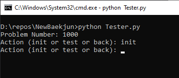
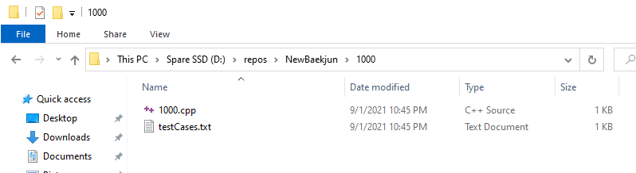
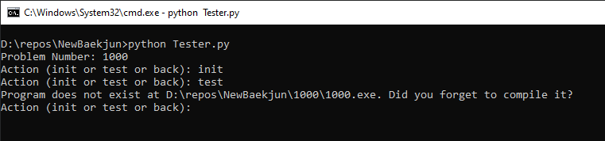
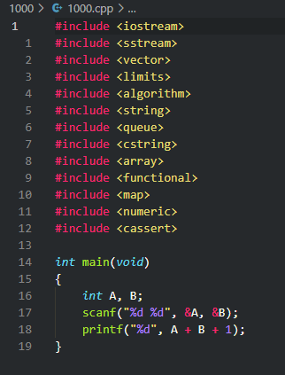
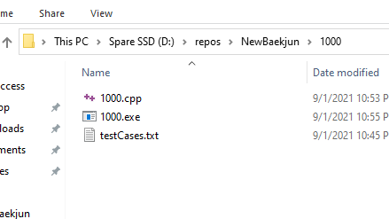
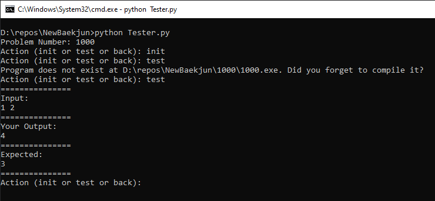

# BaekJunHelper
백준에서 예제 입력 가져와서 테스트 해주는 프로그램입니다.

## 지원언어

1. Python

2. C++

## 설치
`Install.bat`

## 실행
`Run.bat`

## 사용법

1000번 문제로 해볼게요 (https://www.acmicpc.net/problem/1000)

---

#### 1

문제 번호랑 init 쳐줍니다 (스샷에 없지만 언어선택 추가됨)

---

#### 2

init 하면 문제 번호 이름의 폴더가 생성됩니다. 그리고 백준 예제 입력도 웹에서 가져와서 저장됩니다. 예제 입력 파일은 JSON 이라서 테스트케이스 추가하고 싶으면 수동 추가 해도 됩니다. cpp 파일은 repo/CPPTemplate.cpp랑 똑같이 만들어집니다. 파이썬의 경우 그냥 빈 파일이 만들어집니다.

---

#### 3

바로 test 하면 안 되고 문제 풀고 컴파일부터 해야 됩니다. 파이썬의 경우 컴파일이 필요 없습니다. 아래는 C++ 예시입니다.

---

#### 4

적당히 풀고(코드 틀렸음) 컴파일.

---

#### 5

이제 test 하면 테스트 결과 알려줍니다.

---
